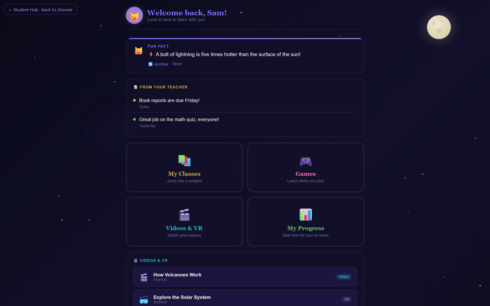
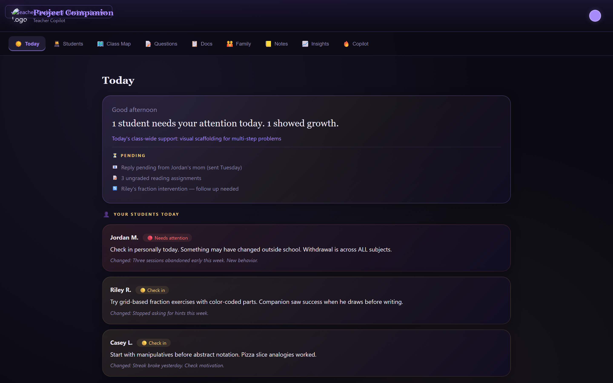
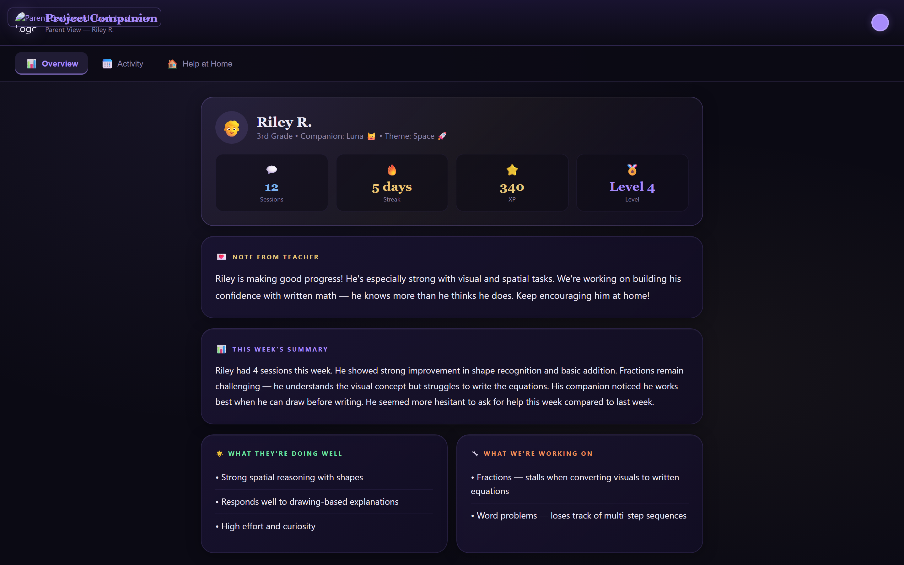

# Project Companion

**A design prototype for a persistent-memory AI learning companion in K–12 education.**

> **Status: design prototype.** This repository contains four React/JSX UI files demonstrating the *design pattern* for a three-sided learning companion (student, teacher, parent) informed by a shared persistent memory. It is **not** a deployed platform. CAMA integration, backend, accounts, COPPA consent flow, content moderation, and persistence are roadmap items — see the [Roadmap](#roadmap) for what is and isn't built. Do not deploy to minors as-is; the components currently call the Anthropic API directly from the browser.

This prototype demonstrates the applied design of [CAMA](https://github.com/LoriensLibrary/cama) (Circular Associative Memory Architecture) in an education context. CAMA is the persistent-memory research system behind [11 Zenodo preprints](https://orcid.org/0009-0005-5803-8401) by the same author; **this repository does not yet integrate with CAMA at runtime** — wiring the prototype to a live CAMA MCP server is the next step.

> **Reviewing the engineering ecosystem?**
> For the mature implementation pattern (typed full-stack, tests, CI, live demo), see [Telos_kalos](https://github.com/LoriensLibrary/Telos_kalos).
> For the shared memory architecture and research, see [CAMA](https://github.com/LoriensLibrary/cama).
> This repository is intentionally the design-prototype stage of the family.

---

## The Problem the Design Addresses

Current AI tutoring tools forget the student every time the session ends. A child who struggled with fractions yesterday starts over today. The teacher has no visibility into what happened. The parent has no idea how to help at home.

Project Companion is a design study of what an AI tutor *informed by persistent, provenance-aware memory* would look like across the three people who actually need to see it: the student, the teacher, and the parent.

---

## What Is Built (UI Prototype)

Four React/JSX files demonstrating the three sides of the design. State is in-memory and resets on refresh; there is no persistence layer in this repository.

### 🎓 Student Hub (`StudentHub.jsx`)



- AI tutoring UI with Socratic-prompt scaffolding (constraint enforced via system prompt)
- Four themed animated worlds (Space, Ocean, Forest, Candy Land)
- Four companion characters
- Subject-based tutoring surfaces across Math, Science, Reading, Social Studies
- Educational mini-games: Quick Quiz, Math Flash, Word Scramble, Memory Match
- XP, streaks, badges, and progress UI (session-local)
- **First live CAMA integration:** the Recent Activity panel on the Progress view reads from a local CAMA backend via the `useCamaMemory` hook (`lib/useCamaMemory.js`). Falls back to fictional sample data when CAMA isn't reachable. See [Running with a live CAMA backend](#running-with-a-live-cama-backend) below.

### 👩‍🏫 Teacher Dashboard (`TeacherDashboard.jsx`)



The teacher-side feature surface is designed but populated by hardcoded sample data:
- **Daily Brief**, **Student Profiles**, **Class Heat Map**, **Question Bank**, **Documentation**, **Family Communication drafts**, **Teacher Notes**, **Insights**, **AI Teaching Copilot**
- These surfaces are UI demonstrations of how teacher-side intelligence would surface *if* the system were wired to a persistent-memory backend.

### 👪 Parent Dashboard (`ParentDashboard.jsx`)



- Overview, activity log, and "Help at Home" surfaces with sample data.

`archive/ProjectCompanion.jsx` is an earlier draft of the student experience preserved for reference; `StudentHub.jsx` is the current cut.

---

## How It Connects to the Research

This is an *applied design study* of a published research architecture, not yet a deployed instance of it.

| Research Foundation | Role in This Prototype |
|---|---|
| [CAMA Core Series](https://doi.org/10.5281/zenodo.19051834) (Papers 1–5) | Source of the three-layer memory architecture, provenance-aware write discipline, and counterweight safety patterns the prototype's UI is designed *around* — but does not yet call. |
| [Applied Series](https://doi.org/10.5281/zenodo.19257809) (Papers 6–9) | Demonstrates that CAMA's framing has been extended to other applied domains; this prototype is the education-domain study. |
| [Identity-Aware Harm Detection](https://doi.org/10.5281/zenodo.19425218) | The three-layer Librarian System is the safety pattern the eventual integrated system would use for child-specific harm detection. Not implemented in this repository. |
| [Platform Regression Study](https://doi.org/10.5281/zenodo.19582820) | Establishes that relational continuity is a measurable, neglected dimension — motivating why persistence matters in education. |

---

## Pilot Intent

**Target**: A K–12 virtual school for a no-cost research pilot.
**Status**: Pre-pilot. The infrastructure listed below as roadmap items must ship before any deployment to minors. The pilot date is intentionally undated — it moves when the COPPA consent flow, backend proxy, persistence layer, and CAMA integration are complete, not before.
**Research goal (if executed)**: Longitudinal study of persistent-memory AI companions in a real K–12 environment with provenance-aware memory and the safety infrastructure described in the published Librarian System paper.

---

## Tech (Current vs. Designed)

| Layer | Currently in This Repo | Designed Target |
|---|---|---|
| Frontend | React + JSX, three dashboard components + a chooser landing | Same, plus shared-component extraction and TypeScript |
| Build | Vite scaffold (`package.json`, `vite.config.js`, `src/main.jsx`, `index.html`) — `npm install && npm run dev` works | Same, with TypeScript and a test suite |
| AI calls | Routed through `lib/callClaude.js` with proper Anthropic auth headers — **still client-side, not deployable to minors** | Backend proxy with key isolation, per-user rate limiting, audit logging |
| Memory (read) | `lib/useCamaMemory.js` reads from a local CAMA dashboard HTTP endpoint (MVP) with sample-data fallback when CAMA isn't running | MCP-over-HTTP `cama_query_memories` call against a per-tenant CAMA backend |
| Memory (write) | None — no student-session memories are persisted yet | `cama_store_exchange`/`cama_store_teaching` against the same per-tenant backend, with provenance tagging |
| Auth | None | Per-student accounts, parent linkage, role-scoped sessions |
| Safety | System-prompt constraints only | Content moderation, age verification, mandatory-reporting plumbing, right-to-delete, COPPA consent |

---

## Repository Structure

```
Project-Companion/
├── StudentHub.jsx           # Student-facing UI
├── TeacherDashboard.jsx     # Teacher copilot UI surfaces
├── ParentDashboard.jsx      # Parent-side surfaces
├── lib/
│   ├── callClaude.js        # Anthropic API wrapper with auth headers
│   ├── callCama.js          # Configurable HTTP wrapper for the CAMA backend
│   └── useCamaMemory.js     # React hook that reads recent topics from CAMA with sample-data fallback
├── data/
│   └── sample.js            # Fictional sample students (clearly labelled)
├── src/
│   ├── main.jsx             # Vite entry
│   └── App.jsx              # Landing-page chooser between the three dashboards
├── docs/
│   └── screenshots/         # Hero images shown above
├── archive/
│   └── ProjectCompanion.jsx # Earlier draft of the student experience (kept for reference)
├── package.json             # React 18 + Vite 5
├── vite.config.js
├── index.html               # Mounts src/main.jsx
├── .env.example             # VITE_ANTHROPIC_API_KEY placeholder
├── LICENSE
└── README.md
```

**Run locally:** `npm install && npm run dev`. The chooser at `/` lets you flip between the Student, Teacher, and Parent dashboards. An Anthropic API key (`VITE_ANTHROPIC_API_KEY`) is required for the AI surfaces — see `.env.example`. **Do not ship a build with a client-side key to any real users**; the production path requires a backend proxy (see Roadmap).

### Running with a live CAMA backend

The Student Hub's **Recent Activity** panel is the first surface in this repo wired to a real CAMA call. It reads from the CAMA dashboard HTTP API and falls back to fictional sample data when no backend is reachable, so `npm run dev` alone is still a complete demo.

To see the live integration with real data:

1. In a separate terminal, start CAMA (uses the synthetic seeded demo DB — your personal corpus is not touched):
   ```bash
   git clone https://github.com/LoriensLibrary/cama.git
   cd cama
   docker compose up
   ```
   Verify `http://localhost:5555/api/data` returns JSON.
2. Back in this repo, run `npm run dev`. Vite proxies `/api/cama/*` → `http://localhost:5555/api/*` (configurable via `CAMA_PROXY_TARGET`).
3. Open the Student Hub → Progress view. The Recent Activity tile should show the **CAMA · LIVE** badge in green and render memory entries from the seeded demo corpus instead of the hardcoded sample list.

**What this integration is and is not.** This is a read-only call against CAMA's dashboard HTTP endpoint (`/api/data`), which serves the same SQLite memory corpus that the MCP tool `cama_query_memories` reads from. It is **not** yet a real MCP-over-HTTP client — the JSON-RPC wire protocol for streamable_http MCP from a browser is still roadmap. Both the dashboard read path and the future MCP read path return the same underlying data; the dashboard endpoint is just the one CAMA already ships and documents publicly. The write path (storing new memories from student sessions back into CAMA) is also roadmap, gated on the backend proxy and per-tenant CAMA routing listed below.

The hook signature `useCamaMemory(studentId, { fallbackTopics })` accepts a `studentId` so the component contract is stable when multi-student routing lands in CAMA; today the argument is used only as a cache key. The single-participant demo corpus serves the same data regardless of `studentId`.

---

## Roadmap

### Built (UI surfaces + first live integration)
- [x] Student companion UI with Socratic-prompt tutoring surface
- [x] Four themed animated worlds
- [x] Educational mini-games (Quiz, Math, Scramble, Memory)
- [x] Teacher dashboard with 9 feature tabs (sample data)
- [x] Parent dashboard surfaces (sample data)
- [x] Teacher question-injection design pattern (UI level)
- [x] AI-drafted family communication surface (UI level)
- [x] **CAMA read integration (MVP)** — Student Hub's Recent Activity tile reads from a live CAMA backend via `useCamaMemory`; falls back to sample data when CAMA isn't running

### Not yet built (required for any deployment)
- [ ] Backend API proxy — remove client-side Anthropic calls
- [ ] User accounts and session persistence
- [ ] Data pipeline connecting student sessions → teacher dashboard → parent view
- [ ] **CAMA write integration** — store new student-session memories back into CAMA with provenance (gated on backend proxy + per-tenant CAMA routing)
- [ ] **CAMA-over-MCP transport** — migrate the read path from CAMA's dashboard HTTP endpoint to the streamable_http MCP wire protocol
- [ ] COPPA-compliant parental consent flow
- [ ] Content moderation and PII scrub on student input
- [ ] Age verification
- [ ] Mandatory-reporting protocol implementation
- [ ] Right-to-delete plumbing across surfaces
- [ ] Accessibility audit (WCAG, reduced-motion, dyslexia-friendly typography)
- [ ] Teacher admin interface for question-bank management
- [ ] Multi-student parent view
- [ ] Build config, tests, CI
- [ ] Pilot deployment

---

## Safety & Privacy — Design Target vs. Current State

Project Companion is designed for children. **Safety claims below describe the design target, not the current repository.** A deployed system must implement each item below before being used with any minor.

| Property | Design Target | This Repository |
|---|---|---|
| Parental consent | COPPA-compliant flow required before any minor uses the system | Not implemented |
| Data collection consent | No conversation storage without explicit opt-in | No storage layer exists |
| Mandatory reporting | Protocol for handling disclosures of harm | Not implemented |
| Provenance-aware memory | Distinguish student statements from AI inferences (CAMA's teaching/inference write discipline) | Not implemented in this repo (UI does not store) |
| Teacher control | Curriculum injection so the companion teaches what the teacher intends | UI pattern demonstrated only |
| Parent visibility | View-only access with clear privacy boundaries | UI pattern demonstrated only |
| Right to delete | Any stored data can be removed at parent or student request | No storage to delete |
| Content moderation | Filter on student input, self-harm detection path | Not implemented |
| Not a clinical tool | Educational support, not therapy or diagnosis | This framing applies to the design |

---

## Related Work

- **CAMA Repository**: [github.com/LoriensLibrary/cama](https://github.com/LoriensLibrary/cama)
- **Published Papers**: [Zenodo — ORCID 0009-0005-5803-8401](https://orcid.org/0009-0005-5803-8401)
- **Dataset**: [HuggingFace — Continuity Burden Dataset](https://huggingface.co/datasets/LoriensLibrary/cama-continuity-burden) (aggregate statistics; raw data not released)
- **Website**: [lorienslibrary.netlify.app](https://lorienslibrary.netlify.app)

---

## Author

**Angela Reinhold** — Independent AI safety researcher, founder of Lorien's Library LLC, computer science student (AI concentration) at Full Sail University.

ORCID: [0009-0005-5803-8401](https://orcid.org/0009-0005-5803-8401)

---

## License

MIT License

© 2026 Lorien's Library LLC
